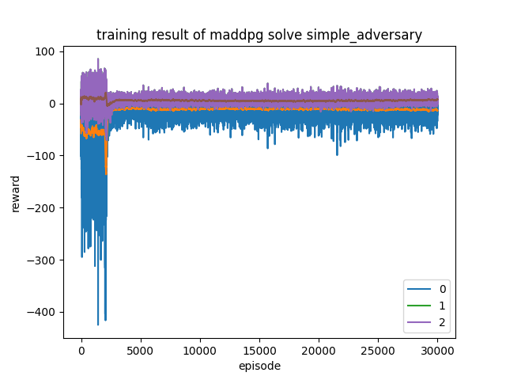
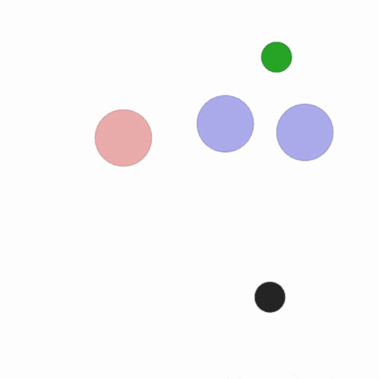
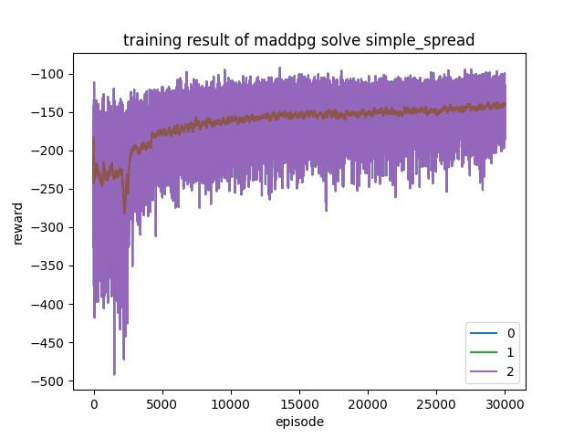
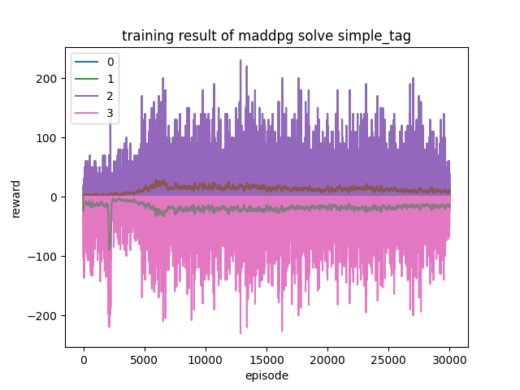
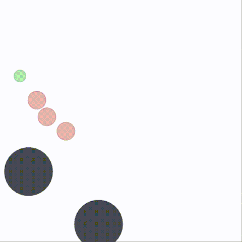

# MADDPG using PyTorch and MPE

implementation of [MADDPG](https://arxiv.org/pdf/1706.02275.pdf) using PyTorch
and [multiagent-particle-envs](https://github.com/openai/multiagent-particle-envs)

# Usage

training and evaluation is simple and straightforward, take `simple_spread` for example:

```shell
python main.py simple_spread  # training
python evaluate.py simple_spread  # evaluation
```

more details about arguments can be found in `main.py`, `evaluate.py`
or simply run `python main.py --help`, `python evaluate.py --help`

# Result

|  environment name   | training result  |  evaluation result  |
|  ----  | ----  | ---  |
| simple_adversary  |  |  | 
| simple_spread  |  |  | 
| simple_tag  |  |  | 

# Trouble shooting

- stop print info while rendering

  comment `line 213` in `multiagent-particle-envs\multiagent\environment.py`

- `ImportError: cannot import name 'prng' from 'gym.spaces'`

  after install multiagent-particle-envs, install an older version of gym

  ```shell
  pip uninstall gym
  pip install gym==0.10.5
  ```

# reference

- implementation of [openai](https://github.com/openai/maddpg)
- implementation of [DKuan](https://github.com/DKuan/MADDPG_torch)